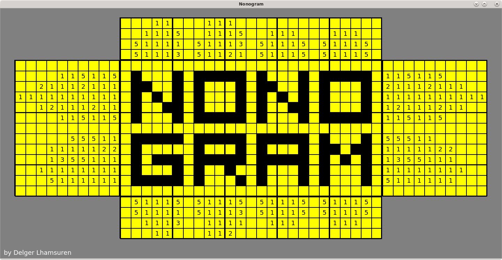
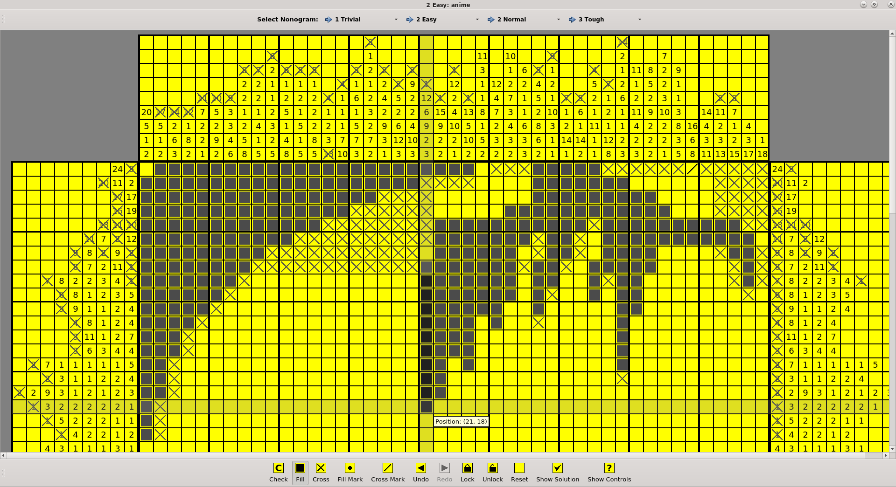

<!-- PROJECT LOGO -->
<br />
<div align="center">
  <h3 align="center">Nonogram</h3>

  <p align="center">
    A nonogram puzzle game in Qt5
  </p>
</div>


<!-- TABLE OF CONTENTS -->
<details>
  <summary>Table of Contents</summary>
  <ol>
    <li>
      <a href="#about-the-project">About The Project</a>
      <ul>
        <li><a href="#built-with">Built With</a></li>
      </ul>
    </li>
    <li>
      <a href="#getting-started">Getting Started</a>
      <ul>
        <li><a href="#prerequisites">Prerequisites</a></li>
        <li><a href="#building">Building</a></li>
      </ul>
    </li>
    <li><a href="#screenshot">Screenshot</a></li>
    <li><a href="#contact">Contact</a></li>
    <li><a href="#acknowledgments">Acknowledgments</a></li>
  </ol>
</details>


<!-- ABOUT THE PROJECT -->
## About The Project



Nonogram, also known as Hanjie, Paint by Numbers, Picross, Griddler, and Pic-a-Pix, and so on, is a picture logic puzzle game in which cells in a grid must be colored or left blank according to numbers at the side of the grid to reveal a hidden picture.

There are already many different implementations of nonograms written in all kinds of programming languages for all kinds of environments, but I have not seen many Qt versions. There was one, but it focussed on creating random puzzles, while this version focusses more on the UX and look and feel of the game. It was also personally interesting to me to see if I can implement a game in Qt, which is primarily intended for more serious desktop applications.

<p align="right">(<a href="#top">back to top</a>)</p>


### Built With

This game was built purely in C++17 using [Qt5](https://doc.qt.io/qt-5/) and [CMake](https://cmake.org/).

Most of the puzzles were borrowed from Juraj Simlovic's [Griddlers Solver](https://jsimlo.sk/griddlers/), a puzzle editor/solver for Windows. A few smaller puzzles were borrowed from [Web Paint-by-Number](https://webpbn.com/).

<p align="right">(<a href="#top">back to top</a>)</p>


<!-- GETTING STARTED -->
## Getting Started

### Prerequisites

This is an example of how to list things you need to use the software and how to install them.
* [CMake 3.15](https://cmake.org/cmake/help/latest/release/3.15.html)
* [Qt 5.9](https://download.qt.io/archive/qt/5.9/)
* Any C++ compiler that supports C++17. I used GCC 8.3.1 on CentOS 7.9.

### Building

   ```sh
   git clone https://github.com/buruburuburuberi/Nonogram.git
   mkdir build
   cd build
   cmake3 ../Nonogram -DCMAKE_INSTALL_PREFIX=/path/to/install/directory
   make install
   ```

<p align="right">(<a href="#top">back to top</a>)</p>


<!-- SCREENSHOT -->
## Screenshot



<p align="right">(<a href="#top">back to top</a>)</p>


<!-- CONTACT -->
## Contact

Delger Lhamsuren - delgerl@web.de

Project Link: [https://github.com/buruburuburuberi/Nonogram.git](https://github.com/buruburuburuberi/Nonogram.git)

<p align="right">(<a href="#top">back to top</a>)</p>


<!-- ACKNOWLEDGMENTS -->
## Acknowledgments

* [Griddlers Solver](https://jsimlo.sk/griddlers/)
* [Web Paint-by-Number](https://webpbn.com/)

<p align="right">(<a href="#top">back to top</a>)</p>
